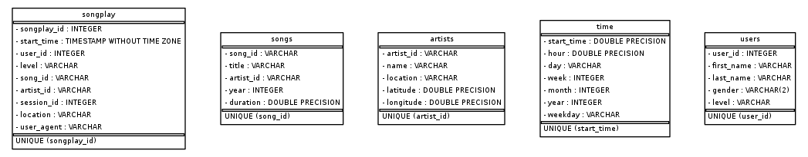

## Data ETL with PostGreSQL

In this project, I went through the process of reading in files of different formats into dataframes, extracting specific information to store, and loading it into tables. The process included updating scripts provided to start including:
- create_tables.py: to execute SQL queries that would allow me to create, drop tables from the Sparkify database
- sql_queries.py: to write SQL queries that would allow me to perform creation, reading, update, and deletion functions on the database tables. This mostly included the main queries to create each table we need and another one to insert data into it
- etl.ipynb: this noteboook was used to come up with the code to do the extraction, transform, and loading (ETL) functions. The idea here was to test all the functions on this file and then move them to a script where the code would be executed for all the data we have.
- etl.py: the script that was created from code in the etl.ipynb. The end result of running this script on the terminal indicated that 71 song data files were processed, while 30 log data ones were processed.
- test.ipynb: this notebook allowed me to test my loading function. For each query to insert/load data, I was able to check and see that all the insertions worked.

I also created a working_scratch_file.ipynb file that allowed me to play around with code before adding it to some portions of the above notebooks and scripts. It was helpful for keeping track of all the steps.

### Database Design
This database has five tables - four dimensions and one fact table.
- songs: dimension table that stores data about the song
- artists: dimension table with artist only data
- time: from logs, this dimension table has a breakdown of different time units from song start times
- users: dimension for the users of the platform playing the music
- songplay: fact table that encompasses all keys of the dimension tables for each time a song was played.

A representation of the database design is illustrated in the below entity relationship diagram:


### ETL Process
To process the data, we access JSON files that contain songs and log data. From these files, we create dataframes and extract fields that are specific to each table defined above. From there, we create and insert data into said dimensions and fact tables to load it.

To run the program:
1. Make sure that the test.ipynb kernel is not running so we can reset the Sparkify database
2. Open a terminal window and use the following command to create all tables in the database
```sh
python3 create_tables.py
```
  Anytime, there needs to be a reset of the database, you will need to run this file.
3. To extract, transform, and load the file data into Sparkify's database, run the following command to execute the script.
```sh
python3 etl.py
```
  On the terminal, you should see print outs of the files being processed as they are found and processed. At the end of the script running, the last of the files will be processed and it will look like this.
  
  

